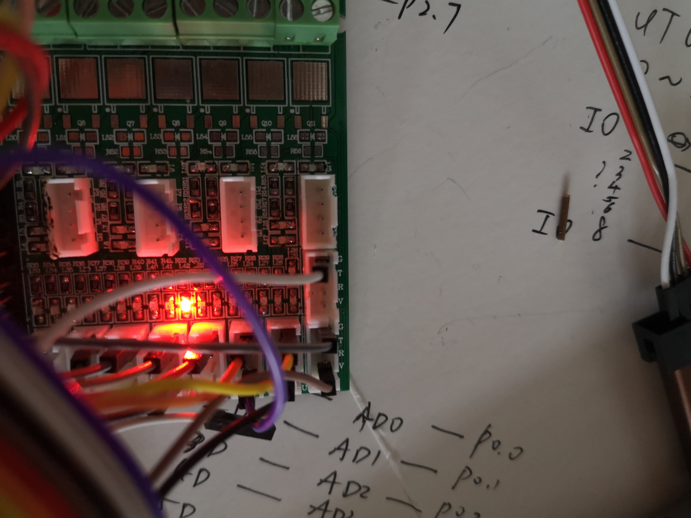

这是18级都一凡实验设计的作业，本仓库包含以下部分：

- 小程序：

  用于数据收集与动作识别；

  模型部署在JS代码当中，可以在飞行模式下离线运行。

- python-notebook：详细介绍了数据处理与模型训练的全过程，包括：

  数据格式化；

  数字信号处理；

  模型选择；

  超参数调优；

  模型导出。

- 单片机：

  将模型部署在单片机上，采用洞洞板+杜邦线连接如下：

  

  为了检验部署是否成功，随机选取10个样本，存储到单片机中进行分类。如果分类正确的个数大于等于7，则L42灯亮；否则L41灯亮。经过试验，当模型部署在单片机上时，能正确识别7个样本，如下图所示，L42灯亮。

  

  ​